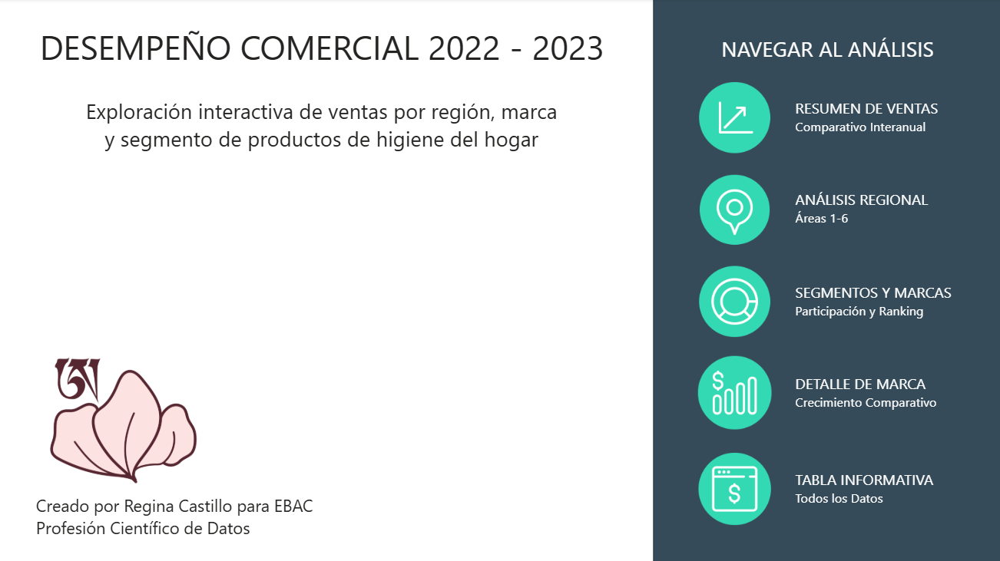
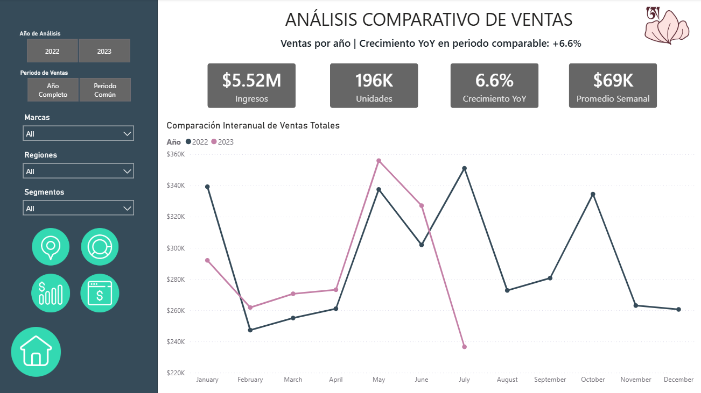
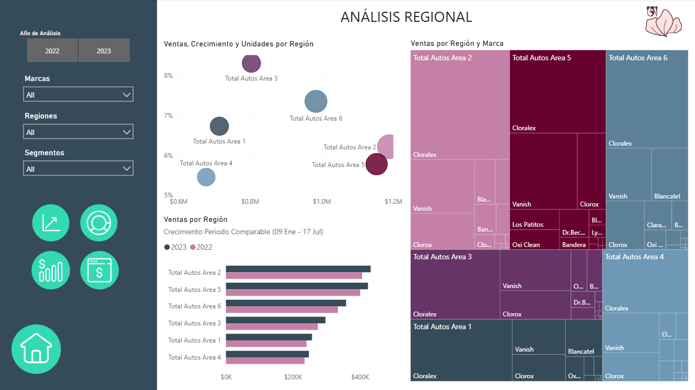
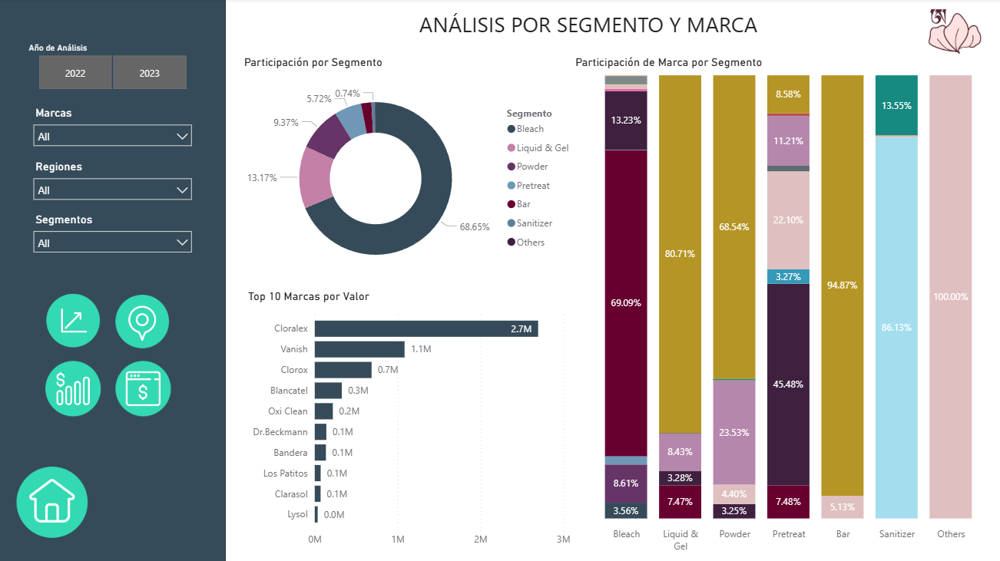
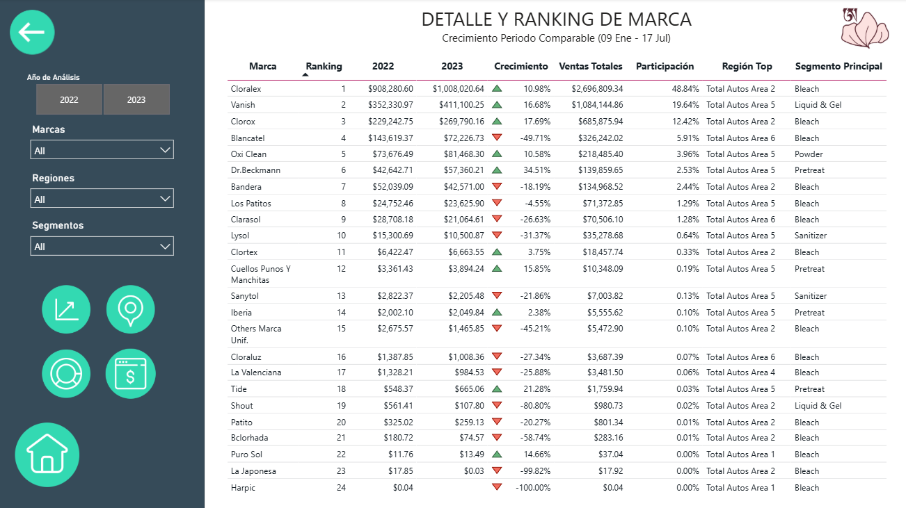
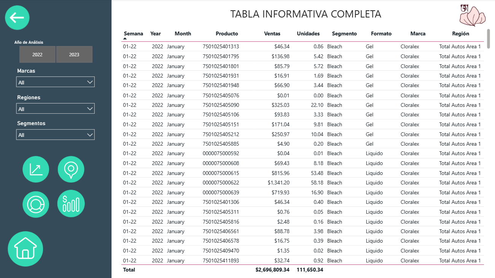
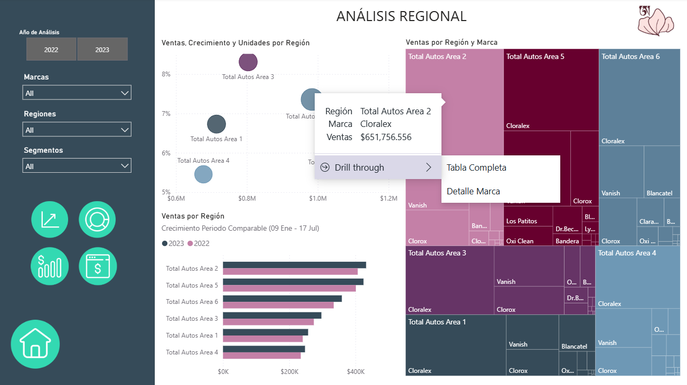
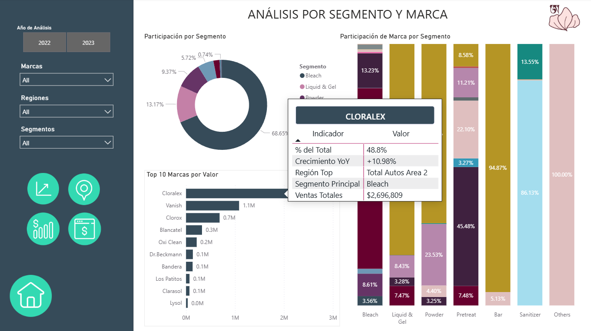
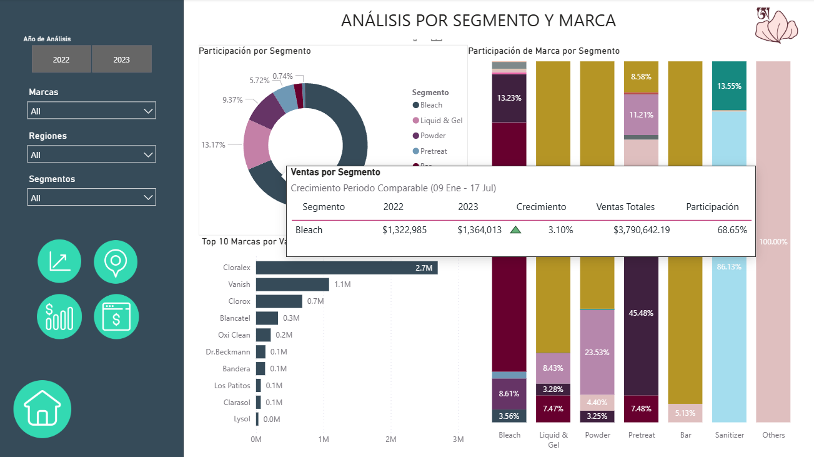
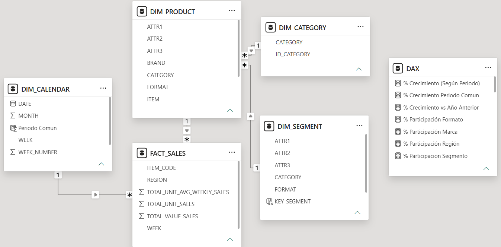

#  Power BI Dashboard: Retail Sales Analysis
### Dashboard de Ventas Retail de Productos de Limpieza

> **EN** · Interactive Power BI dashboard analyzing retail sales of cleaning products (Cloralex, Vanish, Clorox, Lysol, OxiClean) across 6 Mexican regions from Jan 2022 to Jul 2023. Built on a star schema with 5 tables and DAX measures covering revenue, units, market share and brand performance.
>
> **ES** · Dashboard interactivo en Power BI para análisis de ventas retail de productos de limpieza (Cloralex, Vanish, Clorox, Lysol, OxiClean) en 6 regiones de México de ene 2022 a jul 2023. Construido sobre un esquema estrella con 5 tablas y medidas DAX de ingresos, unidades, participación de mercado y desempeño por marca.

---

##  Dashboard Preview / Vista del Dashboard

### Menú de Navegación


### Resumen Ejecutivo


### Análisis Regional


### Segmentos y Marcas


### Detalle por Marca (Drill Through)


### Tabla Completa (Drill Through)


### Ejemplo de donde usar los dos Drill Throughs


### Ejemplo visual de Tootltip de Marca


### Ejemplo visual de Tootltip de Segmento


---

##  Data Model / Modelo de Datos

---

---

| Table / Tabla | Type / Tipo | Description |
|---|---|---|
| `FACT_SALES` | Fact | 122K+ weekly transactions · transacciones semanales |
| `DIM_PRODUCT` | Dimension | Product master · Maestro de productos |
| `DIM_CATEGORY` | Dimension | Category catalog · Catálogo de categorías |
| `DIM_SEGMENT` | Dimension | Segments · Segmentos (Bleach, Powder, Liquid & Gel...) |
| `DIM_CALENDAR` | Dimension | Time dimension · Dimensión de tiempo |

---

##  Report Pages / Páginas del Reporte

| Page / Página | Content / Contenido |
|---|---|
| **Menú** | Navigation hub with buttons · Menú de navegación con botones |
| **Resumen Ejecutivo** | KPIs, total revenue, Growth YoY · KPIs, ingreso total, crecimiento interanual |
| **Análisis Regional** | Sales and trends by region, trends · Ventas y tendencias por región |
| **Segmentos y Marcas** | Market share by segment and brand · Participación por segmento y marca |
| **Detalle Marca** | Drill-down per brand · Detalle por marca con filtros |
| **Tabla Completa** | Full data table with slicers · Tabla completa con segmentadores |

---


##  Technical Highlights / Técnicas Utilizadas

 **Note on YoY Growth Calculation / Nota sobre el cálculo de crecimiento interanual**

EN · Growth YoY calculated using the Common Period (Jan 9 – Jul 17) where both 2022 and 2023 have sales data. After Jul 18, 2023 no records exist, so extending the comparison would not be valid.

ES · El crecimiento YoY se calculó usando el Periodo Común (9 ene – 17 jul) en el que ambos años tienen datos de ventas. A partir del 18 jul 2023 no hay registros, por lo que extender la comparación no sería válido.

 **DAX Measures / Medidas DAX:**

```dax
% Crecimiento Periodo Comun = 
DIVIDE(
    [Ventas Año Actual Periodo Comun]
        - [Ventas Año Anterior Periodo Comun],
    [Ventas Año Anterior Periodo Comun],
    0
)
```

 **Features / Funcionalidades:**
- Navigation menu with page buttons · Menú de navegación con botones
- Custom tooltips per brand and segment · Tooltips personalizados por marca y segmento
- Cross-filtering between visuals · Filtrado cruzado entre visualizaciones
- Mobile layout · Vista móvil configurada
- Star schema data model · Modelo de datos en esquema estrella

---

##  Key Findings / Hallazgos Clave

- **Bleach/Cloralex** dominates with ~68.7% of total sales
- **Region 2 has the most sales** while Region 3 has the most growth
- **Top 3 segments** (Bleach, Liquid & Gel, Powder) = 91.2% of revenue

---

##  Requirements / Requisitos

```
Power BI Desktop (free) — latest version
Download: https://powerbi.microsoft.com/desktop
```

> Open the `.pbix` file directly in Power BI Desktop.
> No additional data sources needed. Data is embedded.
> Abrir el archivo `.pbix` directamente en Power BI Desktop.
> No se requieren fuentes de datos adicionales. Datos embebidos.

---

##  Repository Structure / Estructura del Repositorio

```
powerbi-retail-sales-dashboard/
├── screenshots/                                        ← Dashboard previews
├── Power BI Dashboard - Retail Sales Analysis.pbix     ← Power BI file
└── README.md
```

---

*Project developed as part of the Data Scientist Certificate · 
Proyecto desarrollado como parte del certificado Científico de Datos — EBAC (2026)* 
